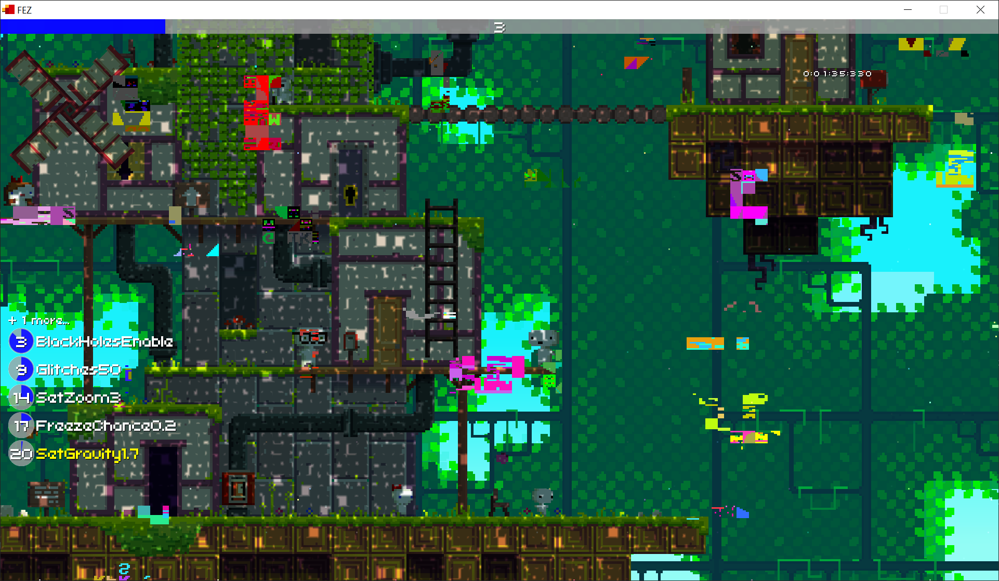

# FezChaosMod

## Overview 

This library is a [MonoMod](https://github.com/MonoMod/MonoMod) mod which adds a chaos mod (game modification that activate a random effect every so many seconds) to FEZ.

Please support me on Patreon: https://www.patreon.com/jenna1337 

This mod is also available on my website: https://sloan4.com/mymods/fez/list_secure.php

## Features

For a full list of features, see [changelog.txt](/changelog.txt)

## Installation

1. Download [MonoMod](https://github.com/MonoMod/MonoMod/releases) and unpack it in the game's directory.
2. Download FEZ.ChaosMod.mm.dll and put it in the game's directory.
3. Run command `MonoMod.exe FEZ.exe` (or drag `FEZ.exe` onto `MonoMod.exe`). This should generate new executable file called `MONOMODDED_FEZ.exe`.
4. Run `MONOMODDED_FEZ.exe` and enjoy!

## Building

1. Clone repository.
2. Copy all dependencies listed in `libs` directory and paste them into said directory.
3. Build it. idk. it should work.
